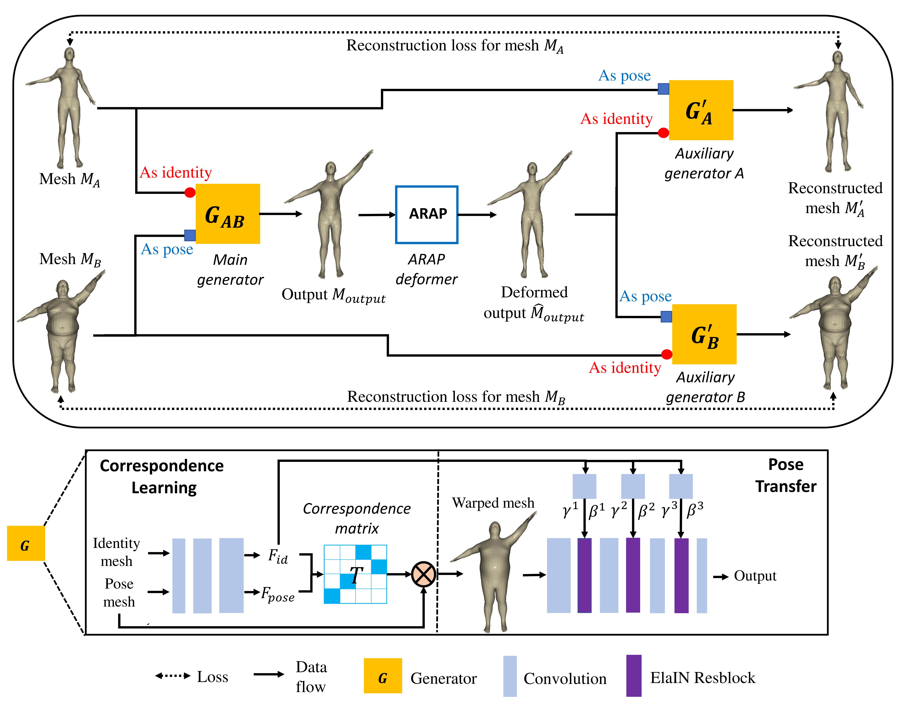

# Unsupervised 3D Pose Transfer with Cross Consistency and Dual Reconstruction

#### [Project](https://chaoyuesong.github.io/X-DualNet/) |   [Paper](https://arxiv.org/abs/2211.10278)

**Unsupervised 3D Pose Transfer with Cross Consistency and Dual Reconstruction** <br>
Chaoyue Song,
Jiacheng Wei,
Ruibo Li,
[Fayao Liu](https://sites.google.com/site/fayaoliu/),
[Guosheng Lin](https://guosheng.github.io/) <br>
Submitted to TPAMI.

 <br>

The code is coming soon!

## Installation
- Clone this repo:
```bash
git clone https://github.com/ChaoyueSong/X-DualNet.git
cd X-DualNet
```

- Install the dependencies. Our code has been tested on Python 3.6, PyTorch 1.8 (previous versions also work, plz install it according to your cuda version). We also need pymesh and open3d.
```bash
conda env create -f environment.yml
conda activate x_dualnet
```

- Clone the Synchronized-BatchNorm-PyTorch repo.
```
cd models/networks/
git clone https://github.com/vacancy/Synchronized-BatchNorm-PyTorch
cp -rf Synchronized-BatchNorm-PyTorch/sync_batchnorm .
cd ../../
```

## Dataset preparation
We use [SMPL](https://smpl.is.tue.mpg.de/) as the human mesh data, please download data [here](https://drive.google.com/drive/folders/11LbPXbDg4F_pSIr0sMHzWI08FOC8XvSY). And we generate our animal mesh data using [SMAL](https://smal.is.tue.mpg.de/), please download it [here](https://drive.google.com/drive/folders/1uP6H0j7mUJ6utgvXxpT-2rn4EYhJ3el5?usp=sharing).

## Generating Meshes Using Pretrained model
By default, we load the latest checkpoint for test, which can be changed using `--which_epoch`.

#### 1) SMPL (human) 
Download the pretrained model from [pretrained model link]() and save them in `checkpoints/human`. Then run the command  
````bash
python test.py --dataset_mode human --dataroot [Your data path] --gpu_ids 0
````
The results will be saved in `test_results/human/`. `human_test_list` is randomly choosed for test and different from it in [3D-CoreNet](https://github.com/ChaoyueSong/3d-corenet).

#### 2) SMAL (animal) 
Download the pretrained model from [pretrained model link]() and save them in `checkpoints/animal`. Then run the command 
````bash
python test.py --dataset_mode animal --dataroot [Your data path] --gpu_ids 0
````
The results will be saved in `test_results/animal/`. `animal_test_list` is randomly choosed for test and different from it in [3D-CoreNet](https://github.com/ChaoyueSong/3d-corenet). For the calculation of CD and EMD, please check [TMNet](https://github.com/jnypan/TMNet) and [MSN](https://github.com/Colin97/MSN-Point-Cloud-Completion).

## Training
#### 1) SMPL (human) 
To train new models on human meshes, please run:
```bash
python train.py --dataset_mode human --dataroot [Your data path] --niter 100 --niter_decay 100 --batchSize 4 --gpu_ids 0,1
```
The output meshes in the training process will be saved in `output/human/`.
#### 2) SMAL (animal) 
To train new models on animal meshes, please run:
```bash
python train.py --dataset_mode animal --dataroot [Your data path] --niter 100 --niter_decay 100 --batchSize 6 --gpu_ids 0,1
```
The output meshes in the training process will be saved in `output/animal/`.


Please change the batch size and gpu_ids as you desired.

If you need continue training from checkpoint, use `--continue_train`.

## Citation
If you find our work is useful to your research, please consider citing the paper:

```bash
@article{song2022unsupervised,
  title={Unsupervised 3D Pose Transfer with Cross Consistency and Dual Reconstruction},
  author={Song, Chaoyue and Wei, Jiacheng and Li, Ruibo and Liu, Fayao and Lin, Guosheng},
  journal={arXiv preprint arXiv:2211.10278},
  year={2022}
}
```


